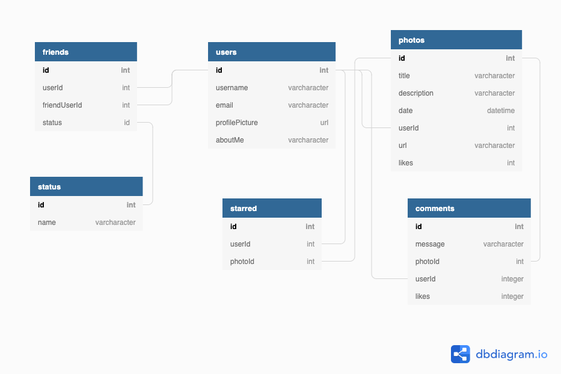

A front-end capstone project from [Kurt Krafft](https://github.com/kurtkrafft) for [Nashville Software School C38](https://github.com/nss-day-cohort-38).

## Brief Proposal

A minimalistic photo storage and sharing app without all the social pressure and clutter that comes with other photo sharing apps. A user can add friends, view their photos, view random peoples photos, and comment on photos as well. This values users privacy and also their right to control their friends.

## MVP Definition

* Written in React.
* Users can create account, login via Session Storage, and logout
* Ability to create, read, update, delete "Photos"
* Ability to create, read, update, delete "Comments"
* Use Semantic UI modals and create a simple yet beautiful looking web app

## Dream Stretch Goals
* Cropping profile pictures so that they will appear the same
* Firebase Authentication
* Friend requests
* Styling

## Setup

Steps to get started:
1. `git clone git@github.com:kurtkrafft1/PhotoLab-Real.git`
1. `cd` into the directory it creates
1. cd into `src/api`  folder
1. enter `json-server -p 5002 -w photoLab.json`
1. press ctrl+t in your terminal and direct to the src folder of the Photolab-Real directory
1.  enter `npm install`
1. wait, when all the dependencies are loaded you may enter `npm start` and view the project
1. Open [http://localhost:3000](http://localhost:3000) to view it in the browser.

## Overview

This App is a simple photo sharing app where a user will be able to upload photos from their personal collection. They can view their friends photos and request to be friends of other users. They can comment on their own photos as well as their friends photos. They can also view their profile and edit their short bio and username. This app gives the user the ability to post freely from their computer without having strangers following them and seeing everything they do. In order to do so, they "stranger" will have to add the user and then get approved by the user to view their data. 

(*) **Note: this is not true authentication.** Email addresses are saved in clear text in the JSON database, and anyone who knows your email could login to see information inside database. Do not store any sensitive information, including, but not limited to birthdates, social security numbers, mother's maiden names, names of first pets, and/or shoe sizes.

## Technologies Used

This project utilizes the following:
* This project was bootstrapped with [Create React App](https://github.com/facebook/create-react-app).
* [Semantic UI](https://react.semantic-ui.com/) for buttons, icons, data-tooltips
* [React Confirm Alert](https://www.npmjs.com/package/react-confirm-alert) for confirm alerts
* [React Router](https://reacttraining.com/react-router/) for page routing
* [React-Burger-Menu](https://github.com/negomi/react-burger-menu) for menu, flexible formatting
* [React-easy-crop](https://github.com/ricardo-ch/react-easy-crop) for cropping photos

## Skills Utilized

We utilized all skills and concepts learned up to this point in our time here at NSS, including:

1. React: hooks, state, props, routes
1. API calls with: POST, PUT, PATCH, DELETE, and GET (with expand, embed)
1. Javascript: functions, objects, arrays, mapping
1. Persistent data storage with JSON Server
1. Github Scrum workflow
1. CSS styling
1. Modular code
1. Semantic HTML
1. [Valid HTML5](https://validator.w3.org/)

## ACCOUNT INFO
* If you like to view a profile that has already been set up with friends etc here are the "login" information
* email: kurt@kurt.com 
* username : JazzMasterKrafft

* if you want to send a friend request to someone and view that feature you can delete Zoolander from JazzMasterKrafft friends list and login as him. His credentials are as followed 
* email : derek@email.com
* username: Zoolander

## Database Diagram
!
